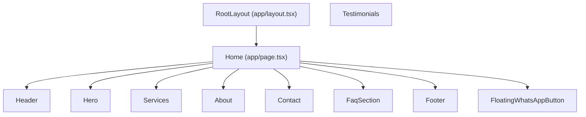

## Arquitetura da landing – Clínica Veterinária Lisiane Martins

Este documento descreve como a landing page é estruturada em termos de layout, composição de seções e componentes principais.

---

### Visão geral

- **Framework**: Next.js (App Router).
- **Entrada principal**: `app/page.tsx`.
- **Layout raiz**: `app/layout.tsx`.
- **Componentes globais**:
  - `components/Header.tsx`
  - `components/Footer.tsx`
  - `components/SectionWrapper.tsx`
  - `components/ui/button.tsx` (e demais componentes de UI shadcn/base-ui).
- **Seções da landing** (em `sections/`):
  - `Hero`
  - `Services`
  - `About`
  - `Contact`
  - `faq/FaqSection` (+ `faq/FaqIllustration`)
  - `Testimonials`
  - `GalleryBento` (atualmente export vazio, pensado para futura galeria).

---

### Layout raiz (`app/layout.tsx`)

Responsável por:

- Definir **fonts** globais: `Geist` (`--font-sans`), `Geist_Mono` (`--font-geist-mono`), `Outfit` (`--font-heading`).
- Importar estilos globais (`app/globals.css`), onde também ficam regras de **scroll para âncoras**: `scroll-behavior: smooth` apenas com `prefers-reduced-motion: no-preference`, e `scroll-behavior: auto` em `pointer: coarse` (touch primário) para evitar saltos no mobile.
- Configurar **SEO e social** via `generateMetadata()`:
  - `title`, `description`.
  - Open Graph (imagem `og.png`, título, descrição).
  - Twitter card.
  - `metadataBase` e `canonical` dinâmicos com base no host (localhost vs produção).
- Injetar **JSON-LD** com o tipo `VeterinaryCare`:
  - Nome da clínica, imagem, URL, telefone, e-mail, endereço, coordenadas, Instagram e horários de atendimento.
- Carregar, em produção, os scripts de analytics:
  - `@vercel/analytics/react`
  - `@vercel/speed-insights/next`

Estrutura simplificada:

```tsx
export default async function RootLayout({ children }) {
  // calcula host, protocol e baseUrl
  // monta jsonLd de VeterinaryCare
  return (
    <html lang="pt-BR">
      <head>
        <script type="application/ld+json" dangerouslySetInnerHTML={{ __html: JSON.stringify(jsonLd) }} />
      </head>
      <body className="{fonts} font-sans antialiased">
        {children}
        {isProduction && (
          <>
            <Analytics />
            <SpeedInsights />
          </>
        )}
      </body>
    </html>
  );
}
```

---

### Composição da página principal (`app/page.tsx`)

A landing é composta por uma sequência de seções, envoltas por `Header` e `Footer`, além de um botão flutuante de WhatsApp:

```tsx
export default function Home() {
  return (
    <>
      <Header />
      <main id="main" tabIndex={-1}>
        <Hero />
        <Services />
        <About />
        <Contact />
        <FaqSection />
      </main>
      <Footer />
      <FloatingWhatsAppButton />
    </>
  );
}
```

- `Header`: navegação fixa no topo (desktop + mobile).
- `main`: contém as seções da página, na ordem:
  1. `Hero`
  2. `Services`
  3. `About`
  4. `Contact`
  5. `FaqSection`
- `Footer`: rodapé com logo, endereço, contatos e direitos autorais.
- `FloatingWhatsAppButton`: botão flutuante com animação de “pulse” levando ao WhatsApp; visibilidade com `IntersectionObserver` na hero e na secção seguinte (`#servicos`), com `setState` só quando o estado derivado (`show` / `hide`) muda (menos re-renders com muitos `threshold`).

Diagrama de alto nível:



> Observação: `Testimonials` existe em `sections/Testimonials.tsx` e pode ser incluído na página conforme necessidade (não aparece no snippet atual de `page.tsx`).

---

### Componente `Header`

Arquivo: `components/Header.tsx`

Responsabilidades:

- Exibir logo da clínica e menu de navegação.
- Oferecer navegação acessível em **desktop** (menu com dropdown) e **mobile** (menu lateral via `Sheet`).
- Atualizar uma CSS custom property `--header-height` com a altura atual do header, usada para `scroll-mt` nas seções (evita que o conteúdo fique “escondido” sob o header fixo).

Principais características:

- Usa `@phosphor-icons/react` para ícones de navegação.
- Usa componentes de UI em `components/ui`:
  - `NavigationMenu`, `Sheet`, `Button`.
- Lista plana `NAV_LINKS` (âncoras: Serviços, Sobre, FAQ, Contato).
- `DesktopNav`: menu horizontal (`NavigationMenu`).
- `MobileNav`: links em `Sheet` lateral (sem accordion).

---

### Componente `Footer`

Arquivo: `components/Footer.tsx`

Responsabilidades:

- Exibir:
  - Logo da clínica.
  - Endereço com link para Google Maps.
  - Contatos: e-mail, WhatsApp, Instagram.
  - Ano atual e aviso de direitos reservados.

Características:

- Usa `next/image` para a logo.
- Usa ícones customizados em `components/icons`:
  - `EmailIcon`
  - `WhatsAppIcon`
  - `InstagramIcon`
- Usa `<address>` semântico para endereço.
- Link de WhatsApp configurado por `NEXT_PUBLIC_WHATSAPP_URL` (fallback para um `wa.me` fixo).

---

### `SectionWrapper`

Arquivo: `components/SectionWrapper.tsx`

Responsabilidade:

- Componente estrutural para normalizar o layout de todas as seções:
  - Largura máxima (`max-w-7xl`).
  - Padding vertical.
  - Padding horizontal responsivo (`px-4 sm:px-6 lg:px-8`).
  - `scroll-mt-[var(--header-height)]` para compensar o header fixo.

API principal:

- `variant?: "normal" | "highlight" | "faq"`:
  - Mapeia para combinações de `maxWidth` e `padding`:
    - `normal`: `py-16 lg:py-24`.
    - `highlight`: `py-32`.
    - `faq`: `py-32`.
- `as?: "section" | "div"` (default: `section`).
- `id?: string`: usado para âncoras de navegação (`#sobre`, `#contato`, etc.).
- `className?: string`: ajustes adicionais de borda, fundo, etc.

Todas as seções de conteúdo (Services, About, Contact, FAQ, Testimonials) usam `SectionWrapper` como base.

---

### Seções principais

#### `Hero` (`sections/Hero.tsx`)

- Seção de destaque inicial (`id="hero"`), com:
  - Altura mínima `min-h-[calc(100svh-var(--header-height))]` (unidade **svh** para altura estável no mobile; evita saltos quando a UI do browser muda).
  - Imagem de fundo (`/images/hero.jpg`) em `Image` full-bleed (`fill`, `priority`).
  - Headline com `h1` e texto orientado a Pelotas / bem-estar do pet.
  - CTA principal **Agende sua consulta** via `HeroMagneticCta` (WhatsApp, nova aba).
- Animações com `framer-motion` na entrada.

#### `Services` (`sections/Services.tsx`)

- Lista de cartões com os principais serviços da clínica:
  - Consultas, Vacinação, Cirurgias, Cardiologia, Preventivo, Atendimento humanizado.
- Cada item contém:
  - Ícone `@phosphor-icons/react`.
  - Título.
  - Descrição curta.
- Layout em grid responsivo (`sm:grid-cols-2`, `lg:grid-cols-3`).
- Envolvida por `SectionWrapper` com `variant="normal"`.

#### `About` (`sections/About.tsx`)

- Seção “Sobre nós” com:
  - Imagem da clínica (`/sobre.jpg`) em um card com borda e `rounded-2xl`.
  - Texto explicando a filosofia da clínica (atendimento humanizado, foco em Pelotas).
  - Lista de valores (“Serenidade”, “Propósito”) com título e descrição.
- Usa `SectionWrapper` com `variant="highlight"` e fundo `bg-surface`.

#### `Contact` (`sections/Contact.tsx`)

- Seção de contato com:
  - Endereço (com link para Google Maps).
  - Telefone/WhatsApp com link clicável (`wa.me` + env).
  - E-mail.
  - Mapa embed de Google Maps em `iframe` responsivo.
- Usa `SectionWrapper` com `variant="highlight"`.

#### `FaqSection` + `FaqIllustration` (`sections/faq/*`)

- `FaqSection`:
  - Título “Perguntas frequentes”.
  - Accordion com perguntas e respostas comuns (horários, primeira consulta, emergências, pagamento).
  - Layout em duas colunas no desktop: accordion + ilustração.
- `FaqIllustration`:
  - Card lateral com imagem (`/faq-illustration.png`) ou fallback com ícone `HelpCircle`.
  - Texto de chamada “Ainda tem dúvidas?”.
  - Dois botões CTA:
    - WhatsApp.
    - Instagram.

#### `Testimonials` (`sections/Testimonials.tsx`)

- Seção de depoimentos de tutores, carregados via `/api/reviews`.
- Usa carrossel `embla-carousel-react`.
- Cada depoimento mostra:
  - Avaliação (estrelas).
  - Texto.
  - Nome e avatar (foto ou iniciais).
- Layout responsivo horizontal tipo slider.

> A inclusão de `Testimonials` na composição da página depende de `app/page.tsx`. No estado atual, o arquivo existe e pode ser plugado facilmente na sequência de seções.

---

### Integrações externas

- **WhatsApp**:
  - URLs centralizadas via `NEXT_PUBLIC_WHATSAPP_URL` com fallback para `https://wa.me/5553981166455`.
  - Usado em:
    - `Hero` (CTA principal).
    - `Contact` (telefone/WhatsApp).
    - `FaqIllustration` (botão de contato).
    - `Footer` (link de contato).
- **Instagram**:
  - Link fixo `https://www.instagram.com/vet.lisianebtmartins/` em:
    - JSON-LD (`sameAs`).
    - `FaqIllustration`.
    - `Footer`.
- **Google Maps**:
  - Links e `iframe` com endereço da clínica.

---

### Resumo

Arquiteturalmente, a landing é composta por:

- Um **layout raiz** forte em SEO e rich snippets (`VeterinaryCare`).
- Um **header fixo** com navegação acessível e responsiva.
- Um conjunto de **seções bem definidas** usando `SectionWrapper` para layout consistente.
- Um **rodapé informativo** com endereço e contatos.
- Um **botão flutuante de WhatsApp** para contato rápido.

Esse desenho facilita futuras adaptações de conteúdo mantendo a estrutura e o estilo da clínica.

